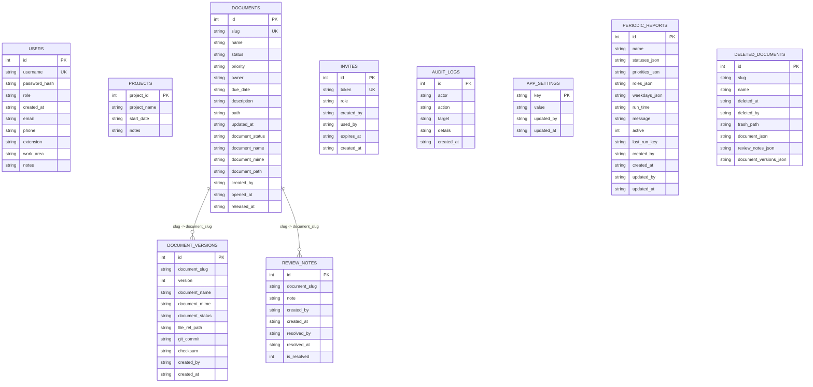
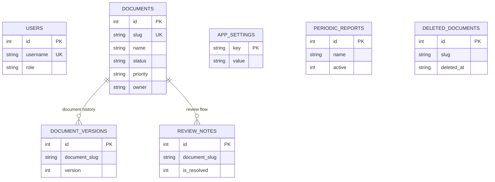

# 14 — Database Structure and Module Mapping (current)

This document describes the **current SQLite data model** and how each ProjectDashboard module interacts with it.

## 1) Database overview

- Engine: **SQLite**
- Main file: `data/projectdashboard.db`
- Initialization/migrations: `init_db()` in `app.py`
- Pattern: table creation + additive migrations via `ensure_column(...)`

## 2) Tables

### `users`
Authentication identities + roles + profile fields.

Main columns:
- `id` (PK)
- `username` (UNIQUE)
- `password_hash`
- `role`
- `created_at`
- `email`, `phone`, `extension`, `work_area`, `notes`

### `projects`
Top-level project registry (semantic/administrative grouping).

Main columns:
- `project_id` (PK)
- `project_name`
- `start_date`
- `notes`

### `documents`
Kanban documents.

Main columns:
- `id` (PK)
- `slug` (UNIQUE)
- `name`, `status`, `priority`, `owner`, `due_date`
- `description`, `path`, `updated_at`
- `document_status`, `document_name`, `document_mime`, `document_path`
- `created_by`, `opened_at`, `released_at`

### `invites`
Invitation links for onboarding.

Columns:
- `id` (PK), `token` (UNIQUE), `role`, `created_by`, `used_by`, `expires_at`, `created_at`

### `audit_logs`
Audit trail.

Columns:
- `id` (PK), `actor`, `action`, `target`, `details`, `created_at`

### `document_versions`
Document version metadata/history.

Columns:
- `id` (PK)
- `document_slug`, `version`
- `document_name`, `document_mime`, `document_status`
- `file_rel_path`, `git_commit`, `checksum`
- `created_by`, `created_at`

Constraint:
- `UNIQUE(document_slug, version)`

### `review_notes`
Review notes and resolution state.

Columns:
- `id` (PK)
- `document_slug`, `note`, `created_by`, `created_at`
- `resolved_by`, `resolved_at`, `is_resolved`

### `app_settings`
System key-value settings.

Columns:
- `key` (PK), `value`, `updated_by`, `updated_at`

### `periodic_reports`
Periodic reporting configuration + runtime state.

Columns:
- `id` (PK), `name`
- `statuses_json`, `priorities_json`, `roles_json`, `weekdays_json`
- `run_time`, `message`, `active`, `last_run_key`
- `created_by`, `created_at`, `updated_by`, `updated_at`

### `deleted_documents`
Soft-delete archive for deleted documents.

Columns:
- `id` (PK), `slug`, `name`, `deleted_at`, `deleted_by`, `trash_path`
- `document_json`, `review_notes_json`, `document_versions_json`

## 3) Module → DB mapping

### A) Authentication / Identity
Frontend:
- `web/login.html`, `web/login.js`, `web/profile.html`, `web/profile.js`

Backend/API:
- `/api/login`, `/api/logout`, `/api/me`, `/api/me/change-password`

Tables:
- `users`, `audit_logs`

### B) Project registry (`projects` table)
Frontend:
- no dedicated CRUD UI yet (table is currently bootstraped in DB layer)

Backend/API:
- no dedicated API endpoints yet (reserved for upcoming project management flow)

Tables:
- `projects`

### C) Kanban (documents)
Frontend:
- `web/index.html`, `web/app.js`, `web/edit.html`, `web/edit.js`

Backend/API:
- `/api/documents` (GET/POST)
- `/api/documents/{slug}` (GET/PATCH/DELETE)

Tables:
- `documents`, `audit_logs`

### C) Document upload + history
Frontend:
- Edit screen (document upload + version list)

Backend/API:
- `/api/documents/{slug}/document` (POST/GET)
- `/api/documents/{slug}/document/versions`

Tables:
- `documents`, `document_versions`

Storage:
- `data/docs_repo/...`

### D) Review notes
Frontend:
- Edit screen review panel

Backend/API:
- `/api/documents/{slug}/review-notes` (GET/POST)
- `/api/documents/{slug}/review-notes/{id}` (PATCH)

Tables:
- `review_notes`, `documents`, `audit_logs`

### E) Admin users + invites
Frontend:
- `web/admin-users.html`, `web/admin-users.js`

Backend/API:
- `/api/admin/users`
- `/api/admin/invites`

Tables:
- `users`, `invites`, `audit_logs`

### F) Settings, backup, diagnostics
Frontend:
- `web/settings.html`, `web/settings.js`

Backend/API:
- `/api/admin/settings`
- `/api/admin/settings/test-smtp`
- `/api/admin/system/backup/run`
- `/api/admin/system/diagnostics`

Tables:
- `app_settings`, `audit_logs`

### G) Periodic reports
Frontend:
- Settings > periodic reports section

Backend/API:
- `/api/admin/reports` (+ run/update/delete)

Tables:
- `periodic_reports`, `users`, `documents`, `audit_logs`

### H) Deleted documents lifecycle
Frontend:
- Settings > deleted documents section

Backend/API:
- list deleted documents
- restore
- permanent delete

Tables:
- `deleted_documents`, `documents`, `review_notes`, `document_versions`, `audit_logs`

Storage:
- `data/deleted_documents/...`

## 4) Quick ER diagram (Mermaid)

## 5) Compact ER diagram (meeting view)

## 6) Logical relations

- `documents.slug` ↔ `review_notes.document_slug`
- `documents.slug` ↔ `document_versions.document_slug`
- `deleted_documents` stores serialized snapshot data for restore.

Note: consistency is primarily enforced by application logic (not strict SQL foreign keys).
